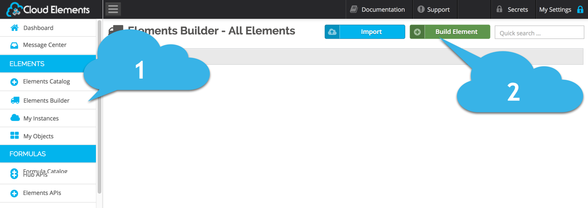
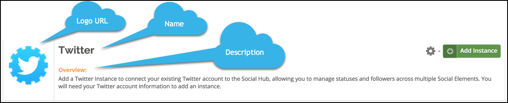

## Element Builder UI BETA

<span style="color:red"> If this is no longer in Beta, we should remove those references.</span>

Element Builder gives you the ability to create custom integrations to cloud services using the Cloud Elements API Management Platform. Using Element Builder, you can configure an Element and publish it to your private Elements Catalog while automatically generating interactive API Documentation using Swagger 2.0. You can aggregate services by creating a Hub or mapping your new Element to an existing Hub. You can also utilize the normalized resources that we have already organized into Hubs, and leverage the same resources across any other Element you build.

This guide is intended for individuals familiar with APIs, Javascript, and JSON. To create an Element we recommend that you have a thorough understanding of:

* API authorization concepts, endpoint setup, and Javascript.
* The API of the cloud service that you you are connecting to.
* The cloud service API documentation.
* The Cloud Elements Hub APIs  https://developers.cloud-elements.com/docs/hubs/hub-docs.html

Before you begin, make sure that you know the answers to the following questions:

* Where is the API documentation?
* What kind of API? REST, SOAP, database?
* What kind of authentication? OAuth 1 or 2? Basic? AWS V2 or V4?
* Does the endpoint support events or bulk?

## Workflow

Element Builder is a tabbed wizard that walks you through the steps to build elements. On each tab you will enter information about the element. Although the tabs imply a linear workflow, you can move between tabs after you complete the first few. We document each tab, or workflow step, in it's own section of this guide:

* [Set up the Cloud Service](#set-up-the-cloud-service)
* [Start Element Builder in Cloud Elements](#start-element-builder-in-cloud-elements)
* [Info Tab: Basic Information About the Element](#enter-basic-information-about-the-element)
* [Configuration Tab: Set Up Element Configuration](#set-up-element-configuration)

## Set up the Cloud Service

<span style="color:red"> Use this section to describe what the user needs to get, whether it's setting up a connected app or  just acquiring the information that they need.</span>


Let’s get started with the construction of the Twitter Element by first creating a new Twitter connected app.

Follow these steps to set up a Twitter application with the endpoint.

Via a web browser, go to [https://apps.twitter.com/app/new](https://apps.twitter.com/app/new).

1. Click “Create application”.

2. Enter you callback URL. For this example, let’s assume that the URL for your application is: `https://www.mycoolapp.com/oauth`


3. Click “Yes, I agree”.

4. Click “Create your Twitter application”.


5. Click “Keys and Access Tokens”.

6. Copy “API Key”.

7. Copy “API Secret”.


The next step is to log in to the [Cloud Elements API Manager](https://console.cloud-elements.com/elements/jsp/login.jsp) and begin building the Twitter Element.

## Start Element Builder in Cloud Elements

After you get the information that you need to set up your element, begin the process in Cloud Elements.

1. Log in to the [Cloud Elements API Manager](https://console.cloud-elements.com/elements/jsp/login.jsp).
1. Click __Elements Builder__.
1. Click __Build Element__.


Element Builder guides you through a series of pages where you define the element.

## Enter Basic Information About the Element


If you are familiar with setting up an Element, just complete the [Quick Steps](#info-tab-quick-steps). If you need more information, see the reference tables: [Info Tab Basic Components](#info-tab-basic-components) and [Authentication Types](#authentication-types).

### Info Tab Quick Steps

1. Select the Hub to associate with the Element.
1. Enter the __Name__ that you want to use for the new element.
1. Update or accept the default __Element Key__, which uniquely identifies the element.
1. Enter a __Description__ to help users understand what the element is intended to do.
1. Enter a __Logo URL__ for an image to associate with the element.

  * You can see the Name, Description, and Logo URL on the finished Element in the Element Catalog.
  

1. Select the __Authentication Type__ used by the cloud service API. Review the Authentication Type table to help select the appropriate authentication type.
    __Note__: Most API documentation identifies the Authentication Type in an Authentication section. Be sure to read and udnersatnd the entire Authentication section.
1. Select a __Protocol Type__.
1. Click __Next__.

### Info Tab Basic Components

| Info Tab Components | Description    |
| :------------- | :------------- |
| Hub       | Hubs map resources from a collection of endpoints (What we call Elements) into a uniform set of APIs.<br />Add a new hub from the dropdown menu to create a new collection if our defaults do not meet your needs.     |
| Name | The name of the Element. This helps form the default Element Key |
| Element Key | A unique identifier of the element. The default comes from the Element Name. |
| Description | Use the Description to provide detailed information about the Element |
| Logo URL | The URL to the image associated with the Element. The Cloud Elements logo is the default. |
| Authentication Type | See [Authentication Types](#authentication-types). |
| Protocol Type | Use the Protocol Type to identify the kind of Element that you are building, REST, SOAP, or database. <br />- For REST APIs, select HTTP<br />- For integrations with databases, select JDBC<br />- For SOAP APIs, select SOAP. |

### Authentication Types

| Authentication Type | Description    |
| :------------- | :------------- |
| Basic      | Integrations authenticate with the cloud service via user name and password.       |
| OAuth 1 | Integrations authenticate with the cloud service via OAuth 1. OAuth 1 does not require users to expose their credentials. OAuth 1 is a three step authentication process. The OAuth 1 protocol involves signing the payload on every request and thus is used by many financial services. <br /> While OAuth 1 provides a standard way to authenticate, many cloud services implement it in unique ways. Cloud Elements implements OAuth 1 to the specification defined at [OAuth Core 1.0 Revision A](https://tools.ietf.org/html/rfc5849) |
| OAuth 2 | OAuth 2 authentication is a newer two step process employed by many of the today’s modern cloud services like Google. While it’s a reasonably simple protocol, it’s also not very strongly specified, so make sure you read the documentation below to make sure you’re using it correctly. <br /> While OAuth 2 provides a standard way to authenticate, many cloud services implement it in unique ways. Cloud Elements implements OAuth 2 to the specification defined at [OAuth.net](https://oauth.net/2/)|
| AWS V2 | Amazon Web Services Signature Version 2 for older AWS resources. |
| AWS V4 | Amazon Web Services Signature Version 4 for the latest AWS resources.|
| Custom | For user defined authentications, such as passing an API key in the header or login requests made during provisioning where tokens are passed. <br /> Because OAuth 1 and 2 are implemented differently at different cloud services, you might need to choose Custom even if the cloud service. |


## Set Up Element Configuration


Use the Configuration tab to set up Element-level configurations. This is different than resource-level configurations. The Configuration tab includes different parameters depending on the Authentication Types and Protocol Types that you selected on the Info tab.            

Depending on the cloud service, element configurations can be complicated, so this section includes step-by-step instructions and reference material.

* Instructions
  * [Quick Steps](#configuration-tab-quick-steps)
  * [Adding Element Configurations](#adding-element-configurations)
  * [Adding Element Parameters](#adding-element-parameters)
  * [Adding Element Hooks](#adding-element-hooks)
* References
  * [Base URL and Pagination](#base-url-and-pagination)
  * [OAuth Authorization](#oauth-authorization)

### Configuration Tab Quick Steps

1. Enter the __Base URL__ (or __jdbc URL__ for JDBC Protocol Types) where all API Requests will be sent. See [Base URL and Pagination](#base-url-and-pagination).
1. Enter the __Max Page Size__ supported by the cloud service. See [Base URL and Pagination](#base-url-and-pagination).
1. Select the __Pagination Type__ supported by the cloud service. See [Base URL and Pagination](#base-url-and-pagination).
1. If the Cloud Service uses OAUth 1 or OAuth 2, complete the following: See [OAuth Authorization](#oauth-authorization).
  * OAuth Authorization Url:
  * OAuth API Key:
  * OAuth API Secret
  * OAuth Callback URL:
  * OAuth Token URL:
  * OAuth Scope:
  * OAuth Request Token URL (OAuth 1):
  * OAuth Request Authorization Type (OAuth 1):
  * Oauth Refresh Token Url (OAuth 2):
  * Oauth Revoke Token Url (OAuth 2):
1. Select the format of the request (__Accept Header__) and response (__Content-Type Header__) types. Cloud Elements supports JSON and XML.
1. Set up any configuration required for the Element. A value which is stored when a connection to the endpoint is created. This value is populated via user input and will be used when invoking the API, e.g. an api_key and api_secret. See [Adding Element Configurations](#adding-element-configurations).
1. Set up parameters. A globally defined value that will apply to all API calls. Parameters can be sent as a header, path, query, body. See [Adding Element Parameters](#adding-element-parameters).
1. Set up hooks. re-Hook: Action you wish to execute prior to sending API calls e.g. manipulating or adding data (query, header, path, body, configuration). Post-Hook: Modify the response data (body, header, configuration) on the return call from the endpoint. See [Adding Element Hooks](#adding-element-hooks)
1. Click __Next__.

### Base URL and Pagination

| Component   | Description     |
| :------------- | :------------- |
| Base URL <br /> Jdbc URL      | The entry point URL to the API. This is typically located in a "Base URL" section of the API documentation.       |
| Max Page Size (or limit) | The maximum number of objects to receive as supported by the cloud service. This is typically found in the "Pagination" or "Paging" sections of the API documentation. |
| Pagination Type | Allows you to modify how large result sets are split into individual pages of data. <br />- page starts with 1 or 0: some cloud services start pagination at one and others at zero. Check the cloud service API documentation. <br />- offset: select if the cloud service uses offsets and you want to access a portion of the data. <br />- cursor: select if the cloud service uses cursor pagination types to enable navigation through large data sets. In the API docs, you can also look for references to "next page token"|

### OAuth Authorization

Element builder enables you to quickly set up OAuth 1 and OAuth 2 standard flows. However, if the cloud services deviates, you can use the Configuration and Parameters sections to support those differences.

| OAuth Parameter | Description     |
| :------------- | :------------- |
| OAuth Authorization Url       | Most endpoints have this information in the Authentication section of the API Documentation       |
| OAuth API Key | The API Key is generated when the connected app is created. |
| OAuth API Secret | he API Secret is generated when the connected app is created. |
| OAuth Callback URL | The same callback URL used when the connected app was created. In our example: `https://www.mycoolapp.com/oauth`. |
| OAuth Token URL | Most endpoints have this information in the Authentication section of the API Documentation. |
| OAuth Scope  | Some endpoints require read and write privileges to objects. This information can be found in the Authentication section of most endpoint API documentation. |
| OAuth Request Token URL (OAuth 1) |  |
| OAuth Request Authorization Type (OAuth 1) |  |
| Oauth Refresh Token Url |  |
| Oauth Revoke Token Url |  |

### Adding Element Instance Configurations

Each Element includes Instance Configuration parameters that are required to provision an instance of an element. This includes all client-specific information required by the cloud service.

When you provision instances of any element, you must complete Instance Configuration

* Base URL requires a variable to accommodate for client or user specific ID

#### Element Configuration Parameters

|  Configuration Parameter    | Description     | More |
| :------------- | :------------- | :------------- |
| Key       | A unique identifier for the configuration.  |
| Name | The name that appears in the Instance Configuration. |
| Type | The type of field that will appear to the user in Instance Configuration. <br />If you do not display the configuration as an Instance Configuration, select a type that matches the configuration. |  - Boolean: The field appears with True and False options. <br /> password encrypted |
| Is it Required? |  |
| Description |  |
| Default Value |  |
| Hide from console? |  |
| Display Order |  |


### Adding Element Parameters


### Adding Element Hooks


#### Instance Tab

Test the connection to the endpoint by creating an instance.

Input a name for the instance, e.g. Test

Click “Create Instance”

In our example, this will take us through the Twitter OAuth 1.0a workflow.  A login screen will be presented, credentials inputted, and authorization of the app granting permission to the Twitter user profile.

Click “Next”


#### Resources Tab

Add entities/resources to your Element within the Resources Tab.  Resources will need an HTTP verb like POST, GET, PATCH, PUT, or DELETE associated with it.  If the Element being created can be identified with one of Cloud Elements current hubs, pre-built resources can be used to get started in mapping out resources.

We will begin adding a resource from one of the pre-built items available since we added Twitter to the Social Hub.  Once we complete adding that resource, we will add one from scratch.

##### ADDING A RESOURCE FROM CLOUD ELEMENTS PRE-BUILT API CALLS

The endpoint API documentation will be needed to find out the following:

* vendor path of the resource
* HTTP verb
* JSON payload if applicable

In our example, Twitter was placed within the Social hub.  There are 5 pre-built resources available.  See screenshot.

To add a pre-built resource click the “arrow” and the resource will be added.  In our example, we will add the GET /users resource from the pre-built list.

Click the arrow in the GET /users resource


The pre-built GET /users API call will have some fields already populated.  In order to complete the resource fields, the endpoint documentation will be needed.

In our example, Twitter provides API documentation for the GET /users/search resource here:  [https://dev.twitter.com/rest/reference/get/users/search](https://dev.twitter.com/rest/reference/get/users/search)

The Twitter documentation reveals the vendor path to the resource:
[https://api.twitter.com/1.1/users/search.json](https://api.twitter.com/1.1/users/search.json)

Since the base URL was inputted on the Configuration Tab, only the `/users/search.json` is needed.

Select the “Type” , e.g. API as we are adding an API

Input `/users/search.json` in the “Vendor Path” field

The method and description have been populated as well.  We will touch on these when we add a resource from scratch in the next section.

The parameters will need to be added next.  A parameter must be defined on the Cloud Elements side and the vendor side.  For example, in our GET /users API call, the pageSize will be what Cloud Elements expects.  Twitter expects count instead of pageSize.  We reflect these name variations within the parameter fields.  Let’s take a look at this example in the Element Builder UI.

The column on the left is what Cloud Elements expects.  The column on the right is what the endpoint expects, in this case, Twitter.  Let’s take a look at the fields:

* __Name:__ Cloud Elements uses pageSize when getting the number of records on a page.
* __Vendor Name:__ What the endpoint expects.  In our example, Twitter refers to “count” as the number of records on a page.
* __Type:__ Query – Cloud Elements is sending the endpoint a query request.
* __Vendor Type:__ Query – the endpoint expects a query search in this API call.
* __Data Type:__ Integer – the data type (string, integer, etc)
* __Vendor Data Type:__ Integer – data type the endpoint expects
* __Parameter Source:__ Request – the request is coming from Cloud Elements to the endpoint.  The reverse is also possible, Cloud Elements receives a response from the endpoint.  In our example, we are sending a `GET` request to Twitter.
* __Is it Required?:__  If the endpoint expects this parameter on every API call, select “yes”.  If it is optional, select “no”.
* __Description:__  input a description of the parameter, e.g. the number of objects to be returned.


Click “Add Parameter”

Populate the parameter with the data above

Click “Done”

The information required for the vendor fields was found in Twitter’s API documentation: [https://dev.twitter.com/rest/reference/get/users/search](https://dev.twitter.com/rest/reference/get/users/search).


Cloud Elements supports the following parameter types:

Configuration: value that has been saved to the instance
Header: value to be added in the header of the API request
Path: value to be added to the URL of the API request
Body: value to be sent with as data such as a JSON payload with the API request
Query: query request
Form: needed when multiple items must be sent in parts such as an ID, followed by the body
Multipart: needed when performing a file upload
Value: an exact value to be sent with the API request
Body Field: field sent in the body of the request
Body Token: token sent in the body of the request

Let’s add the other two parameters needed to complete the GET /users API call: page and where.  These three parameters are needed by Cloud Elements to properly make a GET request on a resource.  We’ll use the Twitter API documentation once again to complete the parameters.

Let’s begin with the page parameter.

Click “Add Parameter”

Input each of the fields:
* __Name:__ page
* __Vendor Name:__ page – taken from the Twitter documentation
* __Type:__ Query
* __Vendor Type:__ Query
* __Data Type:__ integer
* __Vendor Data Type:__ integer – taken from the Twitter documentation
* __Parameter Source:__ request – Cloud Elements is making the request
* __Is it Required?:__ No – according the Twitter documentation it is optional
* __Description:__ Specifies the page of results to retrieve.

Click “Done”


One pre-built parameters were included in the GET /users call.  The vendor fields must be completed.

Under “where” click “Edit”


Input each of the vendor fields:
* __Vendor Name:__ converter:toQueryParameters – this is to convert the call from the Cloud Elements Query Language (CEQL) to a vendor query
* __Vendor Type:__ Query
* __Vendor Data Type:__ string – taken from the Twitter documentation
* __Parameter Source:__ request – Cloud Elements is making the request
Is it Required?: Yes – according the Twitter documentation it is required
* __Description:__ The CEQL search expression. The only valid field to search by is ‘q’ which represents the users’ username

Click “Done”


Test out the newly created API by clicking “Try it out”

This action will open a sliding panel displaying the newly created API call.


In the ‘where’ field, input ‘q=”jonsmith”‘
The q=’username’ is the format in which Twitter expects query requests.  Information taken again from the endpoint’s API documentation.

Click “Try it out!”


This action will execute the API call.  The column on the right will show you information regarding the vendor request – what Cloud Elements sends to the endpoint.  This is very helpful when trying to debug an API call.
The column on the right displays the object returned from the executed API call.


##### ADDING A RESOURCE FROM SCRATCH

Adding a resource from scratch is very similar to using one of Cloud Elements pre-built resources with the exception of completing a few more fields.

For this example, the POST /statuses resource will be added to our Twitter Element, otherwise known as tweeting.  The API documentation will be needed found here: [https://dev.twitter.com/rest/reference/post/statuses/update](https://dev.twitter.com/rest/reference/post/statuses/update).

Looking at the API documentation, the tweet must be sent as JSON in the form of a query within the URL.  The only required parameter is ‘status’.  This parameter will be added, however the other optional parameters will not for this demonstration.


Click “+ Add”

Select the Resource Type, e.g. “API”

Input the Path: `/hubs/social/statuses`

Input the Vendor Path: `/statuses/update.json` – taken from the Twitter API documentation

Input the Method: `POST`

Input the Vendor Method: `POST`

Input the Description – what your users will see when they view the API documentation, e.g. “Create a new status for your profile”


Click “Add Parameter”

Input the Parameter Fields:
* __Name:__ status
* __Vendor Name:__ status
* __Type:__ Query
* __Vendor Type:__ Query
* __Data Type:__ string
* __Vendor Data Type:__ string
* __Parameter Source:__ Request
* __Is it Required:__ Yes
* __Description:__ The text of your status update

Click “Done”

Click “Try it out” and test the new resource


Input a Tweet

Click “Try it out!”


View the response

Again, this screen can be used to inspect and debug requests and hooks.

To add more resources, repeat the steps outlined above.


#### ADDENDUM:  Models Tab

The Models Tab is an additional feature with some __optional functionality__ to make resource creation more streamlined.

__NOTE:__  This functionality is only available for endpoints with JSON payloads.  SOAP endpoints or endpoints with XML payloads are not currently supported.

The Freshdesk endpoint will be referenced in this portion of the documentation.

The Models Tab allows the user to build resource models via customization, as well as, an import function.

We will take a look at the Freshdesk Company endpoint which we will map to the Account resource.

A review of the Freshdesk API documentation is needed prior to making any changes to the resource.  The docs can be found here:  [https://developer.freshdesk.com/api/#view_company](https://developer.freshdesk.com/api/#view_company)

##### MODEL CUSTOMIZATION

Click on the Models Tab.  If you have any unsaved progress, an alert will appear asking if you want to save your changes.

The current list of API resources will render.

Select a model to edit.  In our example, we will be viewing the GET /accounts resource.


Looking at the “updated_at” field, we can see the value is a date.


In our model, the data type is set to string.


This can be modified within the code editor.

Change “type” to “date”

Click “Save Model” to update the resource


##### IMPORT MODELS

To import a model, head to the endpoint API documentation.  Navigate to the desired resource and locate the example response.

Copy the response payload.


Select the resource in the list: GET /accounts

Click “Generate from Payload”


Paste in the model

Click “Generate Model”

The model is now built. If you wish to make any changes, they can be made right in the code editor panel. Just remember to save your changes.


#### Events Tab

Events:  Cloud Elements currently supports building integrations with polling or webhooks capability.  Polling is a mechanism where Cloud Elements executes the configured query every __n minutes__ and capture the changed information.  Webhooks are when the provider lets Cloud Elements know what information has changed.

__Polling:__  In order to enable polling, the endpoint must support querying an object by last updated date.

__Webhooks:__ In order to enable webhooks, the endpoint must support them.  Note additional endpoint setup may be required prior to creating your Element.  An event hook script must be defined that transforms the inbound event data to a format that Cloud Elements supports.

Twitter supports a create_at field.  However, they do not support an updated_at field.  Since the updated_at field is not supported, polling will occur on objects created since a certain day and time.

Let’s take a look at an example.

Partial JSON payload of Twitter `GET /users resource`:

```JSON
[
  {
    "profile_sidebar_fill_color": "DDEEF6",
    "profile_background_tile": true,
    "profile_sidebar_border_color": "C0DEED",
    "name": "Twitter API",
///////////////////////////////////////////////////////
////"created_at": "Wed May 23 06:01:13 +0000 2007",////
///////////////////////////////////////////////////////
    "profile_image_url":
    ...
  }
]
```

We’ll be using the `created_at` field in our where clause below.

Select “Yes” for “Enable Events and setup events configuration

Select “Polling”

Under the “users” resource click “Edit”


In the “Where field with operator” field, input `created_at` with operator `>`, or `created_at >`

Select a date format that the endpoint expects. This information is available under the endpoint API documentation.

Under the advanced section, input `created_at` in the Update Date Field and Created Date Field.

Select the same Date format as above to match what the endpoint expects.

Click “Done”


#### Bulk Tab

Cloud Elements supports bulk download of objects in JSON format if the endpoint support filter by date.

The following fields are required to enable bulk download:

Bulk Query Time Format:  Select a time format from the dropdown list.  The time format must match the endpoint’s supported time format for queries.
Bulk Query Field Name:  Provide an object and an operator in the Bulk Query Field Name, e.g. where orders >= “{time_format}”.
Bulk Query Operator: The Bulk Query Operator can be set to “=” or “>=”.

Twitter supports a create_at field.  However, they do not support an updated_at field.  Since the updated_at field is not supported, bulk download will occur on objects created since a certain day and time.

Let’s take a look at an example.

Partial JSON payload of Twitter GET /users resource:

```JSON
[
  {
    "profile_sidebar_fill_color": "DDEEF6",
    "profile_background_tile": true,
    "profile_sidebar_border_color": "C0DEED",
    "name": "Twitter API",
///////////////////////////////////////////////////////
////"created_at": "Wed May 23 06:01:13 +0000 2007",////
///////////////////////////////////////////////////////
    "profile_image_url":
    ...
  }
]
```

We’ll be using the `created_at` field in the Bulk Query Field Name below.

61. In the Bulk Query Field Name, input `created_at`

62. Select the Bulk Query Date Format, the format the endpoint expects.  This can be found in the endpoint API documentation.

63. Input a Bulk Query Operator.  The Bulk Query Operator can be set to `=` or `>=`.

64. Click “Done”


#### Documentation Tab

View the newly created API documentation for Element.  Try out the API calls right from Element Builder.

View the new Element documentation by selecting an instance from the dropdown: “Change Instances”.


If an instance has not been created, click “Add Instance”.


Try It Out:  Click on a resource, e.g. GET /users

Input the query parameter: q=’jonsmith’

Click “Try it out!”


View the response.


Click “Done”


#### Admin Dashboard

Within the in Admin Dashboard, the following functions are available to exercise on all Elements created using Element Builder:

* __Edit an Element:__ change a URL, add a resource, edit configurations
* __Deactivate:__ deactivates an Element, temporarily removing it from the catalog
* __Delete:__ deletes an Element, permanently removing it from the catalog
* __Export:__ exports Element JSON, this JSON can be imported at a later time

To access the Element admin functions, click on the gear.

To import Element JSON, click “Import Element” and follow the prompts.  All functionality will be available based on the last state of the Element prior to export.


#### Support

Element Builder is currently in BETA.  We would love to hear about enhancements or concerns regarding the application.  Please don’t hesitate to get in touch.

Need some help?  Don’t hesitate to reach out to [Cloud Elements Support](mailto:support@cloud-elements.com) with any questions or concerns.

The Cloud Elements Team
